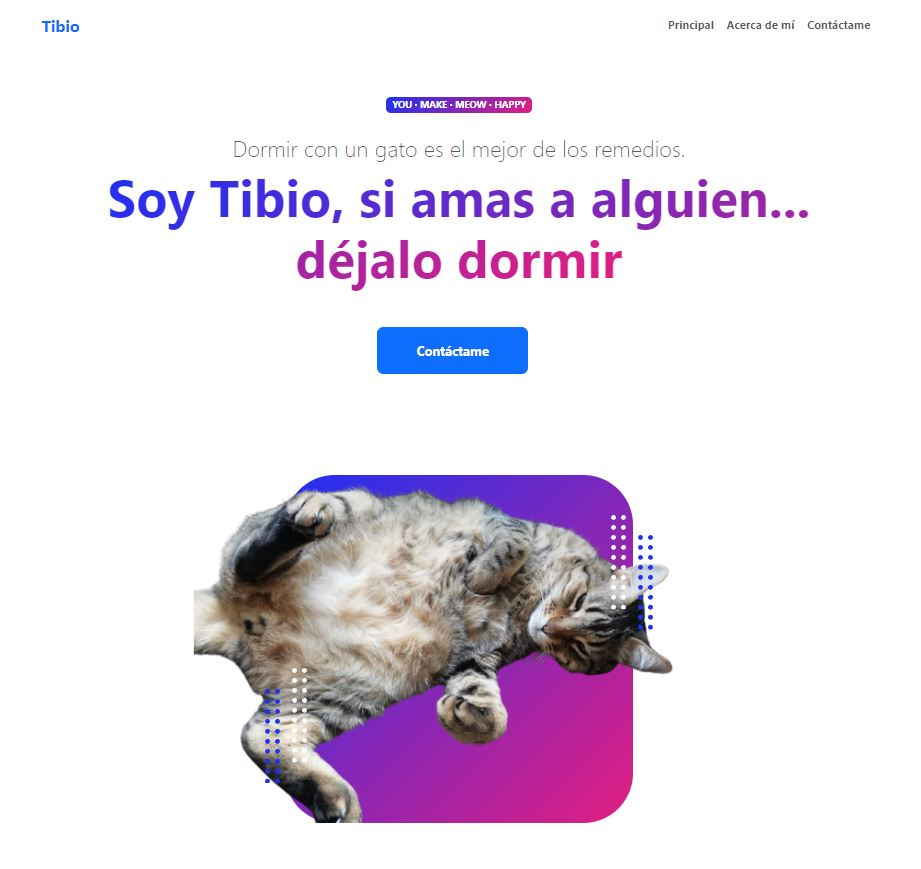

# Personal Page

<figure style="text-align:center">
  
</figure>


Welcome to the **Personal Page** project! This repository contains a simple profile page(based in https://startbootstrap.com/theme/personal) where users can submit their contact information via a form, and the data is sent to a backend server using an HTTP POST request. The HTTP POST request is pre-integrated with https://formsubmit.co/

The form includes fields for:
- Name
- Email
- Phone
- Message

The form submission is handled via JavaScript using the `fetch` API to send data asynchronously. The UI includes features such as loading spinners and validation feedback to improve the user experience.

## Features
- Asynchronous form submission using `fetch` and promises.
- Form validation using HTML5 and Bootstrap classes.
- Visual feedback (loading spinner, success, and error messages).
- Designed with a clean and simple user interface.

## Demo
You can check a live demo of the profile page [here](https://sergiotrrs.github.io/personal-page/).

## Getting Started

### Prerequisites
To run this project locally, you'll need:
- A modern browser (Chrome, Firefox, etc.)
- Basic knowledge of HTML, CSS, and JavaScript.

### Installation

1. **Fork this repository**: You can fork the repository to create your own version of the profile page.
2. **Clone the repository**: Clone the forked repository to your local machine.

   ```bash
   git clone https://github.com/YOUR_USERNAME/profile-page.git
   ```

3. **Open the project**: Navigate to the project directory and open the index.html file in your browser to view the profile page.

### Usage

Edit the form fields to match your desired inputs.
Modify the JavaScript file (main.js) to customize the behavior of the form or adapt it to your backend service.
Submit the form and check the spinner, success, and error messages.